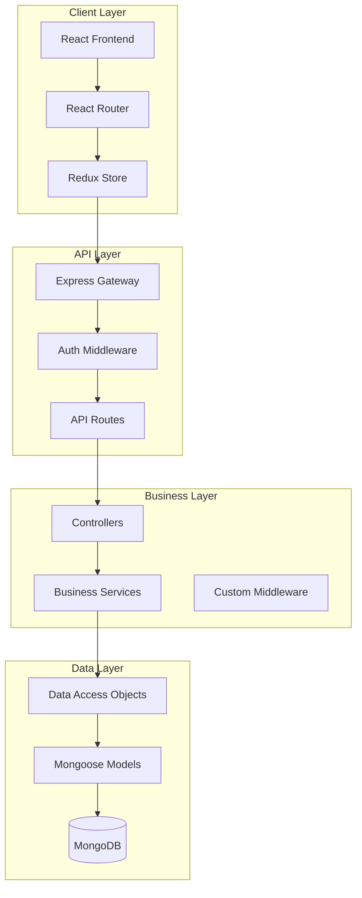
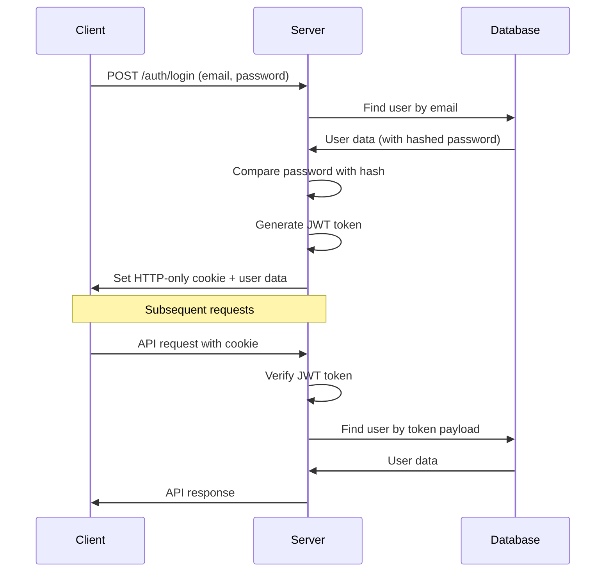

# Architecture Documentation

## System Overview

The URL Shortener is a full-stack web application built with a modern, scalable architecture. It follows a client-server model with clear separation of concerns and modular design principles.

## High-Level Architecture

```
┌─────────────────┐    ┌─────────────────┐    ┌─────────────────┐
│   Frontend      │    │    Backend      │    │    Database     │
│   (React SPA)   │◄──►│  (Node.js API)  │◄──►│   (MongoDB)     │
└─────────────────┘    └─────────────────┘    └─────────────────┘
```

### Architecture Diagram



## Frontend Architecture

### Component Hierarchy

```
App
├── BrowserRouter
│   ├── Auth (Public Route)
│   └── MainLayout (Protected Routes)
│       ├── Header
│       ├── Sidebar
│       └── Outlet
│           ├── Home
│           ├── Links
│           ├── Analytics
│           ├── QR
│           └── Settings
```

### State Management Architecture

```javascript
// Redux Store Structure (Actual Implementation)
{
  auth: {
    isAuth: boolean,
    user: User | null,
    token: string | null,
    status: 'idle' | 'loading' | 'succeeded' | 'failed',
    error: string | null
  },
  url: {
    originalUrl: string,
    shortUrl: string | null,
    loading: boolean,
    error: string | null
  }
}

// Store Configuration
import { configureStore } from '@reduxjs/toolkit';
import { combineReducers } from '@reduxjs/toolkit';
import urlReducer from './features/url/urlSlice';
import authReducer from './features/auth/authSlice';

const rootReducer = combineReducers({
  url: urlReducer,
  auth: authReducer,
});

export const store = configureStore({
  reducer: rootReducer,
});
```

### Data Flow

1. **User Interaction** → Component
2. **Component** → Redux Action
3. **Redux Action** → API Call (Thunk)
4. **API Response** → Redux Reducer
5. **State Update** → Component Re-render

### Routing Strategy

```javascript
// Route Protection Pattern
const ProtectedRoute = ({ children }) => {
  const isAuthenticated = useSelector(state => state.auth.isAuthenticated);
  return isAuthenticated ? children : <Navigate to="/auth" />;
};

// Nested Route Structure
<Routes>
  <Route path="/auth" element={<Auth />} />
  <Route path="/" element={<ProtectedRoute><MainLayout /></ProtectedRoute>}>
    <Route index element={<Home />} />
    <Route path="links" element={<Links />} />
    {/* ... other routes */}
  </Route>
</Routes>
```

## Backend Architecture

### Layered Architecture Pattern

```
┌─────────────────────────────────────┐
│           Presentation Layer        │
│         (Routes & Controllers)      │
├─────────────────────────────────────┤
│            Business Layer           │
│              (Services)             │
├─────────────────────────────────────┤
│           Data Access Layer         │
│               (DAOs)                │
├─────────────────────────────────────┤
│            Data Layer               │
│         (Models & Database)         │
└─────────────────────────────────────┘
```

### Request Flow

```
HTTP Request
    ↓
Express Router
    ↓
Authentication Middleware
    ↓
Route Handler (Controller)
    ↓
Business Logic (Service)
    ↓
Data Access (DAO)
    ↓
Database (MongoDB)
    ↓
Response
```

### Middleware Stack

```javascript
// Express Middleware Pipeline
app.use(cookieParser());
app.use(cors(corsOptions));
app.use(express.json());
app.use(express.urlencoded({ extended: true }));

// Custom Middleware
app.use('/api/auth', authRoutes);
app.use('/api/url', authMiddleware, urlRoutes);
app.use(errorHandler);
```

## Database Architecture

### Schema Design

```javascript
// User Collection
{
  _id: ObjectId,
  name: String,
  email: String (unique, indexed),
  password: String (hashed),
  avatar: String,
  createdAt: Date,
  updatedAt: Date
}

// ShortUrl Collection
{
  _id: ObjectId,
  full_url: String,
  short_url: String (unique, indexed),
  clicks: Number,
  user: ObjectId (ref: User, indexed),
  createdAt: Date,
  updatedAt: Date
}
```

### Indexing Strategy

```javascript
// Performance Indexes
db.users.createIndex({ email: 1 }, { unique: true });
db.shorturls.createIndex({ short_url: 1 }, { unique: true });
db.shorturls.createIndex({ user: 1 });
db.shorturls.createIndex({ createdAt: -1 });

// Compound Indexes for Analytics
db.shorturls.createIndex({ user: 1, createdAt: -1 });
```

### Data Relationships

```
User (1) ──────── (N) ShortUrl
     │
     └── One user can have many short URLs
         Each short URL belongs to one user
```

## Security Architecture

### Authentication Flow



### Security Layers

1. **Transport Security**: HTTPS encryption
2. **Authentication**: JWT tokens in HTTP-only cookies
3. **Authorization**: Route-level access control
4. **Input Validation**: Request data sanitization
5. **Password Security**: bcrypt hashing with salt
6. **CORS Protection**: Origin-based access control

## API Design Patterns

### RESTful API Structure

```
GET    /api/auth/me           # Get current user
POST   /api/auth/login        # User login
POST   /api/auth/register     # User registration
GET    /api/auth/logout       # User logout

POST   /api/url/create        # Create short URL
GET    /api/url/user          # Get user's URLs
DELETE /api/url/:id           # Delete URL
GET    /:shortId              # Redirect to original URL
```

### Response Patterns

```javascript
// Success Response
{
  data: { /* response data */ },
  message: "Operation successful",
  timestamp: "2024-01-01T00:00:00Z"
}

// Error Response
{
  error: "Error description",
  code: "ERROR_CODE",
  timestamp: "2024-01-01T00:00:00Z"
}
```

## Scalability Considerations

### Horizontal Scaling

```
Load Balancer
    ├── App Server 1
    ├── App Server 2
    └── App Server 3
         ↓
    Database Cluster
    ├── Primary (Write)
    └── Secondary (Read)
```

### Caching Strategy

```javascript
// Redis Caching Layer (Future Implementation)
const cacheKey = `url:${shortId}`;
const cachedUrl = await redis.get(cacheKey);

if (cachedUrl) {
  return cachedUrl;
} else {
  const url = await database.findUrl(shortId);
  await redis.setex(cacheKey, 3600, url); // 1 hour TTL
  return url;
}
```

### Performance Optimizations

1. **Database Indexing**: Strategic index placement
2. **Connection Pooling**: MongoDB connection optimization
3. **Compression**: Gzip response compression
4. **CDN**: Static asset delivery
5. **Lazy Loading**: Component-level code splitting

## Monitoring and Observability

### Logging Architecture

```javascript
// Structured Logging
const logger = {
  info: (message, metadata) => {
    console.log(JSON.stringify({
      level: 'info',
      message,
      timestamp: new Date().toISOString(),
      ...metadata
    }));
  }
};
```

### Health Checks

```javascript
// Health Check Endpoint
app.get('/health', async (req, res) => {
  const health = {
    status: 'OK',
    timestamp: new Date().toISOString(),
    services: {
      database: await checkDatabaseHealth(),
      memory: process.memoryUsage(),
      uptime: process.uptime()
    }
  };
  res.json(health);
});
```

## Deployment Architecture

### Development Environment

```
Developer Machine
├── Frontend (localhost:5173)
├── Backend (localhost:5000)
└── MongoDB (localhost:27017)
```

### Production Environment

```
CDN (Static Assets)
    ↓
Load Balancer
    ↓
Application Servers
    ↓
Database Cluster
    ↓
Monitoring & Logging
```

## Future Architecture Enhancements

### Microservices Migration

```
API Gateway
├── Auth Service
├── URL Service
├── Analytics Service
└── Notification Service
```

### Event-Driven Architecture

```javascript
// Event Bus Pattern
eventBus.emit('url.created', {
  userId,
  shortUrl,
  originalUrl,
  timestamp: Date.now()
});

// Event Handlers
eventBus.on('url.created', analyticsService.trackCreation);
eventBus.on('url.created', notificationService.sendConfirmation);
```

### Advanced Caching

```
Browser Cache
    ↓
CDN Cache
    ↓
Application Cache (Redis)
    ↓
Database
```

## Technology Decisions

### Frontend Technology Choices

- **React**: Component-based UI development
- **Vite**: Fast build tool and HMR
- **Redux Toolkit**: Predictable state management
- **Tailwind CSS**: Utility-first styling
- **React Router**: Client-side routing

### Backend Technology Choices

- **Node.js**: JavaScript runtime for consistency
- **Express.js**: Minimal and flexible web framework
- **MongoDB**: Document-based NoSQL database
- **Mongoose**: Object modeling for MongoDB
- **JWT**: Stateless authentication

### Rationale

1. **Full-Stack JavaScript**: Consistent language across stack
2. **React Ecosystem**: Rich ecosystem and community
3. **NoSQL Database**: Flexible schema for rapid development
4. **RESTful API**: Standard, well-understood API design
5. **Modern Tooling**: Fast development and build processes

## Conclusion

This architecture provides a solid foundation for a scalable URL shortening service while maintaining simplicity and developer productivity. The modular design allows for easy testing, maintenance, and future enhancements.
